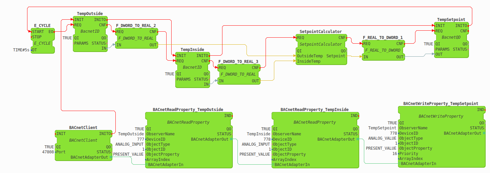

# BACnet Client Module for Eclipse 4diac

This code represents a BACnet/IP client module for [Eclipse 4diac](https://www.eclipse.org/4diac/), which was developed throughout the course of bachelor's thesis at the TU Vienna.

This module is based on the functions provided by the [BACnet Stack library](http://bacnet.sourceforge.net/) and on the FORTE's existing functionality - dynamic IO configuration concept and emBrick module.

Main features:
+ Allows to configure and issue ReadProperty, WriteProperty, and SubscribeCOV service requests
+ Supports BACnet's Who-Is/I-Am services requests and provides automatic network address discovery
+ Supports handling of simple and complex acknowledgments (in response to ReadProperty and WriteProperty) and UnconfirmedCOVNotification services

Tested on:
+ Ubuntu 18.04.5 LTS
+ Raspberry Pi 2 running Raspbian Stretch
+ Raspberry Pi 4 running Raspbian Buster

## Compiling 4diac FORTE with BACnet client module 
### Compiling for a Linux PC using cmake
1. Create a folder for forte's external module (e.g., 'external_modules') and clone this repo into it by executing 'git clone https://github.com/alexandertepaev/forte_bacnet_client_dev.git'
2. Download the [BACnet protocol stack 0.8.6](https://sourceforge.net/projects/bacnet/files/bacnet-stack/bacnet-stack-0.8.6/) and unpack it.
3. Compile the BACnet protocol stack library by executing 'make' command in its root folder.
4. Download [4diac FORTE 1.12.0 sources](https://www.eclipse.org/downloads/download.php?file=/4diac/releases/1.12/forte/forte-incubation_1.12.0.zip) and unpack it.
5. Now configure 4diac FORTE from source using cmake as described in [this](https://www.eclipse.org/4diac/en_help.php?helppage=html/installation/install.html) documentation article. When generating Makefiles, make sure you set CMAKE_BUILD_TYPE to 'Debug', FORTE_ARCHITECTURE to Posix, check the FORTE_IO and the FORTE_MODULE_IEC61131 modules and set the FORTE_EXTERNAL_MODULES_DIRECTORY to the directory created in Step 1.
6. After hitting the 'configure' button, check the FORTE_MODULE_BAcnetClient box. Hit 'Configure'.
7. Provide cmake with a path to the root folder of the BACnet Stack librarty from Step 2.
8. Hit 'configure' + 'generate'
9. Switch to folder with the build and execute 'make' command there
10. Run forte using ./forte

### Cross-compiling for the Raspbian Buster

TODO

## Adding BACnet Client function blocks into the 4diac IDE
1. Download and start [4diac IDE](https://www.eclipse.org/4diac/en_dow.php), it will ask you to choose the workspace directory.
2. After choosing or creating a new workspace directory, copy the 'bacnet_client_fb_type_definitions' folder found in the root of this project into the workspace folder.
3. Start 4diac IDE, BACnet server function block can be now found in the FB Palette. 

## Example BACnet Client IEC 61499 Application

This figure should provide an example of how a simple BACnet Client IEC 61499 application is built. It represents a simple device that calculates a temperature setpoint for a remote controller. It is configured to be able to issue two ReadProperty requests to two different devices (777 and 778). One device is responsible for providing the value of the outside temperature sensor, whereas the other provides the value of the inside temperature sensor. Based on those two values, it calculates a new setpoint for the temperature controller and sends the computed value to it using WriteProperty service request. This whole thing is performed every 5s.

